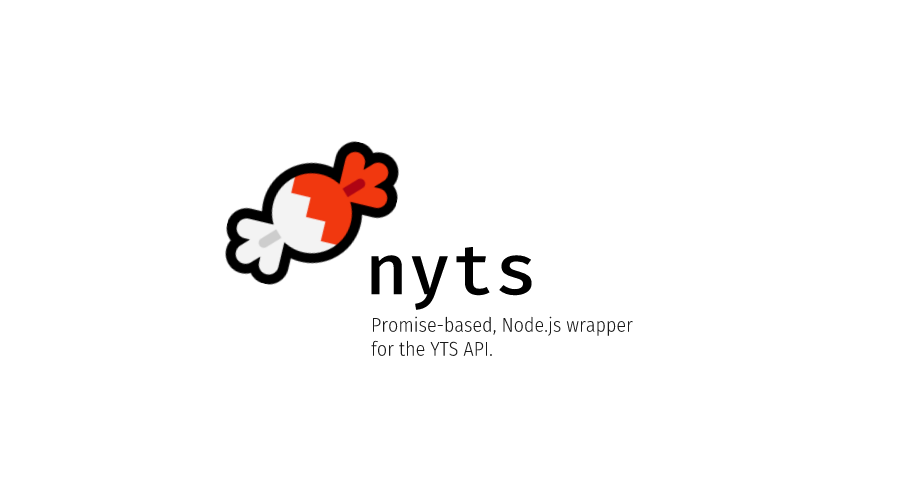

<h1 align="center">
	<br>
	
	<br>
	<br>
	<br>
</h1>

[](https://travis-ci.org/yeskunall/nyts)
[](https://greenkeeper.io/)

### Installing

```shell
$ npm install nyts
```

<!-- Add Yarn support later on, maybe? -->

### Usage

#### ES6 and above

```js
import nyts from 'nyts';
```

#### For everything else

```js
var nyts = require('nyts');
```

_... More info coming soon!_
